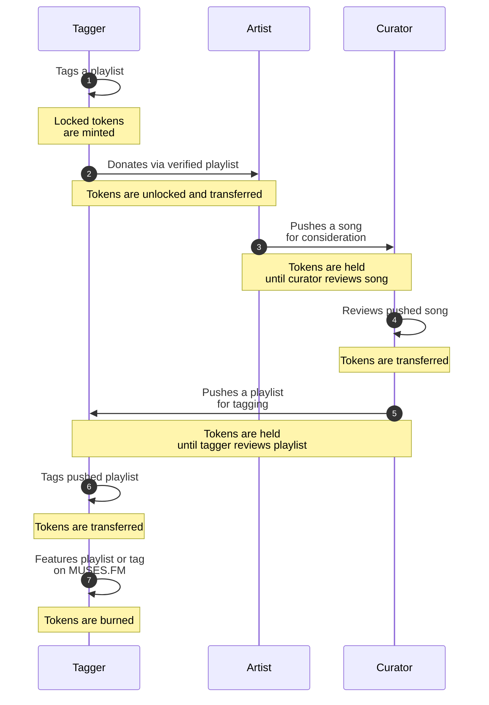

# Economics

> **NOTE:** This document is a draft. Please read as a statement of intentions.

MUSES.FM aims to establish a circular economy between musicians, playlist curators and playlist taggers.

## Roles

MUSES.FM distinguishes user roles in three not mutually exclusive categories: `artists`, `curators` and `taggers`. To act as `artist` and `curator`, the user must have an account on any of the supported music distribution platforms (e.g. Spotify, Apple Music, Audius, etc.). To act as `tagger`, the user does not require having an account on any music distribution platforms but it may be required for having access to certain features.

### Artists

`Artists` are musicians with verified accounts on music platforms. They create the music we all love.

### Curators

`Curators` are playlist curators with accounts on music platforms. They actively look for new music, listen to songs carefully and curate unique playlist.

### Taggers

`Taggers` are the beating heart of MUSES.FM. They listen often to songs in the background, actively look for new playlists and tag them on MUSES.FM. Tags are used as metadata for playlist discovery in MUSES.FM and this value added is rewarded in the form of tokens that can only be donated to artists.

## Token engineering

This section describes the token lifecycle in the circular economy, from minting (creation) to burning (destruction) as well as intermediate steps.

### Minting and donating

Tokens are minted by `taggers` when they tag playlists (`1`). Tags are used as metadata for playlist discovery in MUSES.FM. Minted tokens represent the value added to the platform. Minted tokens are initially locked. This means that `taggers` cannot directly transfer tokens to other DFINITY accounts. Instead, `taggers` are expected to donate their accumulated tokens to `artists` on MUSES.FM. Rather than donating tokens directly to individual artists, `taggers` donate via playlists maintained by `curators` and verified on the platform (`2`). Tokens get distributed equally to all `artists` featured in the chosen playlist. This help prevent winners-take-all dynamics, where popular `artists` would get most of the donations. The playlists on MUSES.FM effectively become a revenue distribution channel for `artists`.

### Unlocking and claiming

Tokens are unlocked by `taggers` when they donate their accumulated tokens to `artists` (`2`). `Artists` don't need to have an account on MUSES.FM to receive tokens. Unlocked tokens are held until the `artist` creates an account on MUSES.FM and connects it to their artist account on the music distribution platform (i.e. Spotify, Apple Music, etc.). Once the accounts are connected, the `artist` can claim all their unlocked tokens. Unlocked tokens can be freely transferred on the DFINITY network. This mean that tokens can be traded on exchanges and that `artists` can sell them right away.

### Usage and promotion

Unlocked tokens can be used by `artists` on MUSES.FM to push songs to `curators` (`3`). This keeps the tokens held until matched `curators` listen to the song, review it and decide if they want to add it to any of their verified playlists or not (`4`). Once a `curator` does the job, the tokens are transferred to them. These tokens are unlocked, meaning that they can also trade them on exchanges and sell them right away. Not limiting the music promotion to songs, `curators` can also use their tokens on MUSES.FM to push playlists to `taggers` (`5`). This keeps tokens held until matched `taggers` tag the playlist. Once an `tagger` does the job, the tokens are transferred to them, this time unlocked (`6`). This allows for `taggers` to finally trade and sell them.

### Burning and featuring

Unlocked tokens can be burned by `taggers` to publicly feature playlists and tags on MUSES.FM (`7`). `Taggers` that burn tokens effectively decline monetary gains to further promote music. Featured content has a prominent position on the user interface, publicly accessible by anyone on the Internet. Burning tokens decrease the supply of tokens, which increases their market value.

## Caveats

This section discusses potential issues in the proposed economic model and possible mitigation strategies.

### Uncontrolled inflation

If the token minting takes place without any form of control, it's very likely that the market will end up flooded with token and the token price collapsing. If the price collapses, neither `artists` or `curators` will be encouraged to use MUSES.FM for monetary gains.

Token minting could implement different forms of throttling to prevent uncontrolled inflation. Some that are currently considered:
- Max daily issuance in the entire platform.
- Max daily issuance per `tagger`.
- Max daily distribution per `playlist`.

Token burning is a parameter that can help as well mitigate inflation. Besides `taggers` being able to burn token for featuring content on MUSES.FM, these are other events that could trigger token burning:
- Unclaimed tokens by `artists` after a certain period of time.
- A percentage of tokens used to push songs and playlists.

The question of who will decide these parameters after launch opens the door to discussions around the governance of the network.

### Sybil attacks

If any throttling is applied to `taggers`, it would be possible for someone to create multiple accounts to overcome limitations. [Gitcoin Quadratic Funding grants](https://gitcoin.co/grants/) gives us examples of how vulnerabilities to sybil attacks can be [exploited](https://gitcoin.co/blog/gitcoin-grants-round-9-governance-brief/) and [mitigated](https://gitcoin.co/blog/defending-quadratic-funding-in-grants-round-10-and-beyond/).

Some ideas that would be applicable to MUSES.FM:
- Limiting minted tokens unless the `tagger` connects their account to other platforms (e.g. Spotify, Twitter, BrightID, etc.).
- Requiring `taggers` to stake an initial amount (this would limit engagement too).
