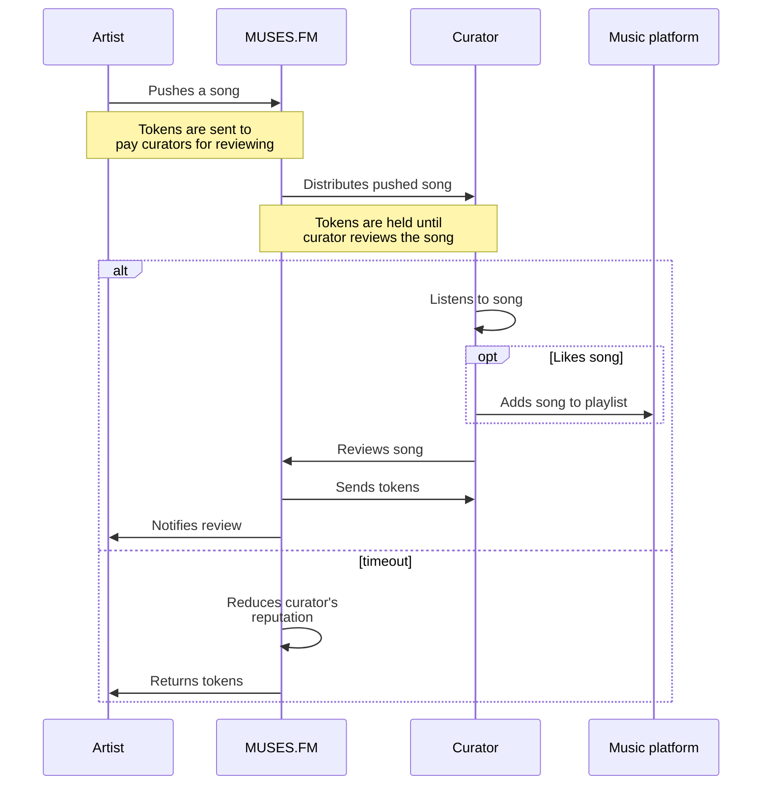
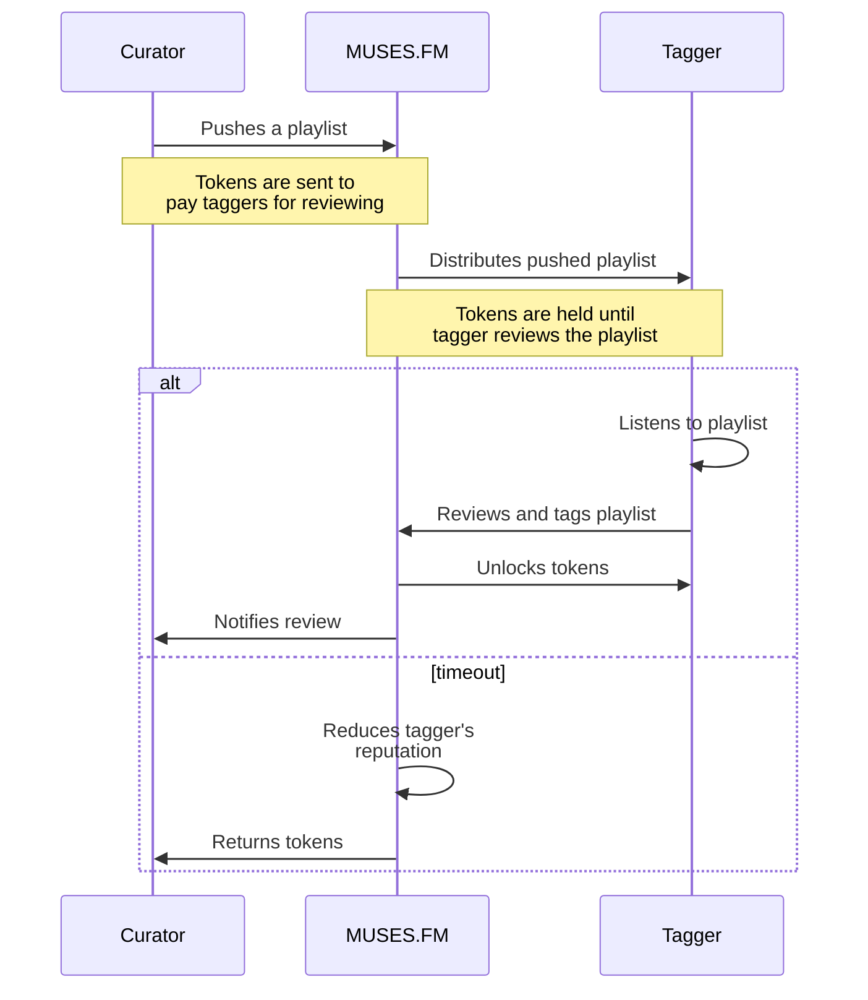
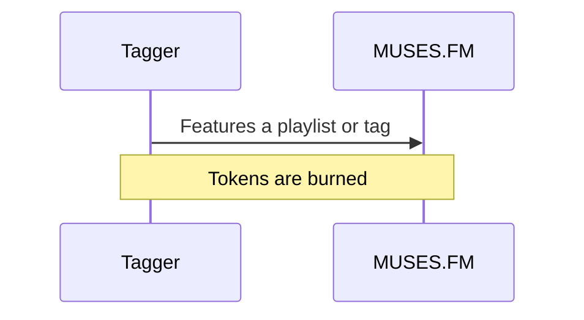

# Product

> **NOTE:** This document is a draft. Please read as a statement of intentions.

This document outlines the vision of MUSES.FM as a product and fleshes out the details for each one of its essential components. In summary, MUSES.FM consists of three independent modules: 1) the **music promotion platform**, 2) the **playlist hub** and 3) the **user profile pages**.

The music promotion platform is the main module of MUSES.FM. `Artists` and `curators` can access this interface to promote their songs and playlists. `Curators` and `taggers` may also access this interface to review songs and playlists.

The playlist hub aggregates playlists from all music platforms. Anyone on the Internet can access this interface to search for playlists as well as browsing qualified, tagged and featured playlists on MUSES.FM. `Taggers` can tag playlists from this interface.

The user profile pages enable social features and interactions. Users of MUSES.FM can display in this interface their activity on the platform, qualified and favorite playlists or promoted songs, and connected accounts in other platforms. Anyone on the Internet can access public profile pages.

In more detail:
- [Music promotion platform](#music-promotion-platform)
  - [Promotion workflows](#promotion-workflows)
    - [Song promotion](#song-promotion)
    - [Playlist promotion](#playlist-promotion)
    - [Tag promotion](#tag-promotion)
  - [Qualifications and reputation](#qualifications-and-reputation)
  - [Content matching](#content-matching)
- [Playlist hub](#playlist-hub)
  - [Playlist aggregator](#playlist-aggregator)
  - [Editorial playlists](#editorial-playlists)
  - [Playlist pages](#playlist-pages)
- [Profile page](#profile-page)

## Music promotion platform

The music promotion platform is centered around playlists and draws inspiration from [PlaylistPush](https://playlistpush.com/). It's main purpose is to allow `artists` to push songs to playlist `curators` in any of the supported music platforms (e.g. Spotify, Apple Music, YouTube, Soundcloud, etc.). `Curators` review received songs and consider them for placement in their playlists. Additionally, `Curators` may also push their playlists to qualified `taggers` for reviewing and tagging.

`Artists` and `curators` must spend tokens to push their songs and playlists. These tokens will be transferred reviewers for their work. `Artists` primarily receive tokens via donations from `taggers`. `Curators` primarily receive tokens from reviewing songs that `artists` push to them and. Both `artists` and `curators` can also purchase token on the market to promote their songs and playlists. `Taggers` may as well feature playlists and tags on the playlist hub by burning tokens.

 There is more information about token dynamics in the [economics document](./economics.md).

### Promotion workflows

There are three types of content that can be promoted in MUSES.FM:
1. Songs, from `artists` to `curators`.
2. Playlists, from `curators` to `taggers`.
3. Tags, from `taggers` to the playlist hub.

#### Song promotion

Song promotion is equivalent to the kind of music promotion that [PlaylistPush](https://playlistpush.com/) offers. `Artists` can push songs they want to promote to `curators`. `Curators` will listen to the received songs, review and consider them for placement in one of their qualified playlists. Songs added to playlists will have greater exposure in music platforms. `Artists` must spend tokens to push a song. `Curators` will receive tokens once they review the song.

#### Playlist promotion

Playlist promotion is similar to song promotion but allowing `curators` to promote their playlists to `taggers`. `Taggers` will listen to the received playlists, review and tag them. Tagged playlists will have more chances of appearing in the search results of the playlist hub and will appear in the `tagger`'s profile page. `Curators` must spend tokens to push a playlist. `Taggers` will receive tokens once they review and tag the playlist.

#### Tag promotion

> DISCUSSION.
> Should we introduce the notion of `label`? A `label` would be a collection of playlists. Rather than promoting tags, which can be applied by many `taggers`, a `label` would be something personal.

> DISCUSSION.
> Is this perhaps too much abstraction? Wouldn't just be easier to `feature` playlists, rather than introducing a new concept? If so, we just need to rephrase this section from `Label promotion` to `Playlist featuring`.

Tag promotion is a unique feature for decentralized music promotion that relies on the playlist hub. `Taggers` can choose to become editors of MUSES.FM by featuring content on the platform. Featured content will have a prominent position in the playlist hub, similar to Spotify editorial playlists. `Taggers` must burn tokens to feature content in the platform.

### Qualifications and reputation

> TODO:

What qualifies as an `artist`?
What qualifies as an `curator`?
What qualifies as an `tagger`?

### Content matching

> TODO:

How is pushed content matched to the right `curators` and `taggers`?

## Playlist hub

The playlist hub provides a rich interface to discover, examine and interact with playlists. It serves three main purposes: 1) acting as an aggregator of playlists from all supported music platforms, 2) offering a decentralized registry of editorial playlists and 3) providing public pages with social features to qualified playlists on MUSES.FM.

### Playlist aggregator

By relying on the tags introduced on MUSES.FM by `taggers`, anyone on the Internet can search playlists by multiple criteria. Imagine being able to search by "electronic downtempo no-vocals melancholic dinner" and filter by music platform (e.g. YouTube and Soundcloud).

### Editorial playlists

Similar to the editorial playlists on Spotify, MUSES.FM offers a registry of featured playlists. Unlike Spotify, this registry is curated by a community of `taggers` that burn tokens to make certain playlists or genres appear as featured.

### Playlist pages

Qualified playlist on MUSES.FM have an associated public page. Playlist pages display rich information from both the music platform where the playlist is hosted and MUSES.FM, like monthly listeners, history of featured artists or current tags. Playlist pages also allow users to leave comments, `taggers` to tag the playlist and `artists` to push songs directly.

## Profile page

> TODO:

- Allow displaying if `artist`, `curator` or `tagger`.
- Mainly thought for taggers.
-
